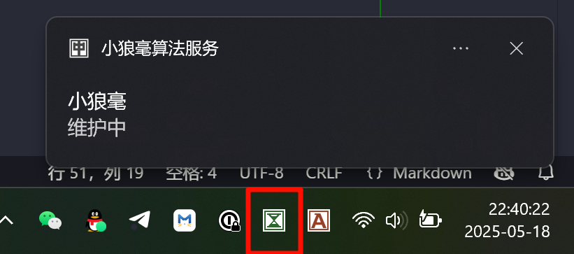

# 阿闷的 Rime 配置

[自用的 Dracula 配色](https://github.com/AmenLi/AmenDracula-for-Rime)

## 基于万象拼音 Pro 方案

对于双拼用户，万象确实是集大成的方案。目前对方案里的注释和说明理解不透彻，主要还是靠 [DeepWiki](https://deepwiki.com/) 和在交流群里询问来解决配置的理解问题。

自定义短语文件 `amen_custom_phrase` 属于隐私，留空不上传。注意使用 Tab 符号做间隔。

## 基于雾凇拼音方案

基于雾凇拼音方案的配置内容在 2025.05.18 以后不再更新。一切以万象拼音方案的配置为准。

使用[雾凇拼音](https://github.com/iDvel/rime-ice)的自然码双拼，无辅助码。

使用[万象拼音方案](https://github.com/amzxyz)的[语法模型+词库](https://github.com/amzxyz/RIME-LMDG)

### 万象的语法模型+词库说明

语法模型为[长期支持版](https://github.com/amzxyz/RIME-LMDG/releases/tag/LTS)，词库为[每夜构建版](https://github.com/amzxyz/RIME-LMDG/releases/tag/dict-nightly)。

请直接使用作者给出的启用方法，只是有一个缺点：
以后更新雾凇拼音后，需要为 `*.schema.yaml` 文件重新添加。

原本使用 `double_pinyin.custom.yaml` 添加语法模型，但并不能正确打出万象拼音 Pro 的示例长句“苍茫的天涯是我的爱绵延的青山脚下花盛开”，其中的部分词语联想不正确。从部署生成的文件及日志文件看，似乎有问题。

使用作者的方法，才能正确打出。但其它长句示例还是会有问题，目前观望中，之后可能全面转万象拼音 Pro。根据其它使用者的说法，直接使用万象拼音效果非常不错。

#### 添加词库

`rime_ice.custom.dict.yaml` 的[做法参考](https://github.com/iDvel/rime-ice/issues/666#issuecomment-2681993098)，[具体写法参考](https://github.com/amzxyz/rime_wanxiang_pro/blob/main/wanxiang.dict.yaml)。

复制雾凇原版 `rime_ice.dict.yaml` 全部内容，再进行修改添加。

为了同时使用雾凇和万象的词库，把雾凇词库的 `base.dict.yaml` 改名为 `rimeice.base.dict.yaml` 以避免部署时的冲突及覆盖。

但因为这些词库太大，部署日志必定会报词组重复的错误。**暂时不知道是否影响正常使用**。

## 重新部署+排查问题

这个配置在部署时**花费时间比较长**，需要耐心等待几分钟，一次部署不生效就部署两次，前提是配置没错。

小狼毫 v0.17后，在任务栏提供了一个图标显示部署状态，可以用作参考

必要时

1. 关闭小狼毫算法服务的进程
2. 删除用户文件夹里 build 文件夹内及日志文件夹内的所有文件
3. 重启算法服务
4. 重新部署
5. 查看部署生成文件和日志文件，进行问题排查。

小狼毫算法服务的进程会自动重启，删除时根据系统提示多关闭几次。

---

项目这里只列出关键配置，默认或自动生成的信息已忽略。

自己修改配置时，请注意 Rime 的 YAML 的语法缩进是两个空格，不能是 Tab 键格式。